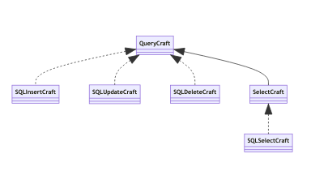

# QueryCraft

version `0.5`

Java framework to semplify DB connection and to generate istruction

## ConnessioneDB

iniziare la connessione (una tantum nel runtime) tramite `ConnessioneDB` :  

```java
if( ! ConnessioneDB.createInstance("nomeutente","psk")) {
	System.err.println("errore");
	System.exit(-1);
}
```

La connessione resta aperta ad oltranza fino a che non si usa il metodo `destroy` della medesima classe. 

ConnessioneDB è una **classe statica** che non richiede di portarsi un istanza, ma fornisce essa stessa un istanza di java.sql.Connection in singleton.

Alcune query, son fornite con `MySqlConnection`:  

| nome metodo ( parametri input ) | output         | breve spiegazione                                   |
| ------------------------------- | -------------- | --------------------------------------------------- |
| `creaDB( String nomeDB)`        | `boolean`      | crea un DB                                          |
| `existDB( String nomeDB)`       | `boolean`      | resistuisce `true` se esiste il DB                  |
| `dropDB( String nomeDB)`        | `boolean`      | Cancella il db                                      |
| `esegui( String queryCompleta)` | `boolean`      | esegue un istruzione MySql                          |
| `query( String queryCompleta)`  | `ResultSet`    | esegue una query, restituisce il ResultSet          |
| `listDB()`                      | `List<String>` | restituisce la Lista dei DB sotto forma di stringhe |


## QueryCraft

Nel package `psykeco.ioeasier.db.querycraft`  si può trovare un sottosistema di creazione delle query da mandare al DB.
Le istanze di `QueryCraft` sono builder che creano delle query a partire da coppia **chiave-valore** che gli vengono date in pasto.

L'interfaccia espone i metodi:

| **Nome metodo**                                    | **Descrizione**  *(***obbligatorio)*                         |
| -------------------------------------------------- | ------------------------------------------------------------ |
| `DB(String) : QueryCraft`                          | imposta il nome del DB*                                      |
| `table(String) : QueryCraft`                       | imposta il nome della tabella*                               |
| `entry(String column, String value) : QueryCraft`  | imposta una coppia colonna-valore all'operatore principale (select, update, insert, etc...) |
| `filter(String column, String value) : QueryCraft` | imposta una coppia colonna-valore alla where                 |
| `validate() : boolean`                             | valida la query, se false qualche parametro necessario non è stato impostato, oppure qualche valore non ha passato la regex |
| `craft() : String`                                 | costruisce la query sotto forma di stringa                   |

 

Sono inoltre disponibili i seguenti metodi/variabili statiche :

- `str(Object o):String`  :  restituisce la rappresentazione stringa dell'oggetto che verrà messa nel DB
  - nel caso delle stringhe ad esempio verranno aggiunti apici singoli `'`
- `BASE_REGEX : String` : è una variabile che rappresenta la regex che viene applicata ai singoli elementi che son imposti come nome colonna, nome db o nome tabella
- `VALUE_REGEX: STRING` : è una variabile che rappresenta la regex che viene applicata ai singoli elementi che  rappresenteranno i valori nelle query


Al momento son presenti le seguenti implementazioni di QueryCraft:




### exception

| Eccezione                       | messaggio                                                 | quando                                                       |
| ------------------------------- | --------------------------------------------------------- | ------------------------------------------------------------ |
| `UnsupportedOperationException` | SqlInsertCraft does not support filter                    | uso dei metodi filter su SqlInsertCraft (non  ha una where)  |
| `UnsupportedOperationException` | SqlDeleteCraft does not support entry                     | uso dei metodi entry su SqlDeleteCraft ( non ha campi di selezione ) |
| `IllegalArgumentException`      | nome tabella/db necessario                                | Durante la fase di validazione, è stata trovata una tabella o db esistente ( son due messaggi diversi, a seconda di cosa non è stato trovato) |
| `IllegalArgumentException`      | Una chiave/ il valore di una chiave è stata trovato vuoto | Durante la fase di validazione, è stata trovata una chiave o il valore di una chiave vuoti ( son due messaggi diversi, a seconda di cosa non è stato trovato) |
| `IllegalArgumentException`      | Nome tabella/db/chiave/valore non valido                  | Durante la fase di validazione, son stati trovati dei valori di tabella/db/chiave/valore non validi () son quattro messaggi diversi, a seconda di cosa non ha passato la regex) |


## TableCraft 

La `TableCraft` crea le istruzioni per generare, eliminare e trarre informazioni dalle tabelle a partire dalle classi java. Per farlo usa la **reflection**.

Espone i seguenti metodi:

| **Nome metodo**                | **Descrizione** *(***obbligatorio)*                          |
| ------------------------------ | ------------------------------------------------------------ |
| `DB(String) : TableCraft`      | imposta il nome del DB *                                     |
| `table(Class) : TableCraft`    | imposta il nome della tabella *                              |
| `suffix(String) : TableCraft`  | imposta un suffisso                                          |
| `prefix(String) : TableCraft`  | imposta un prefisso                                          |
| `primary(String) : TableCraft` | aggiunge una chiave primaria                                 |
| `validate() : boolean`         | valida la query, se false qualche parametro necessario non è stato impostato, oppure qualche valore non ha passato la regex |
| `create() : String`            | costruisce l' istruzione di creazione sotto forma di stringa |
| `exists() : String`            | ccostruisce la select sotto forma di stringa                 |
| `drop() : String`              | costruisce l' istruzione di drop sotto forma di stringa      |


L'unica implementazione disponibile è quella di `SQLTableCraft`


## DBCraft 

La `DBCraft` crea le istruzioni per generare, eliminare e trarre informazioni dalle tabelle a partire dalle classi java. Per farlo usa la **reflection**.

Espone i seguenti metodi:

| **Nome metodo**                | **Descrizione** *(***obbligatorio)*                          |
| ------------------------------ | ------------------------------------------------------------ |
| `DB(String) : TableCraft`      | imposta il nome del DB *                                     |
| `validate() : boolean`         | valida la query, se false qualche parametro necessario non è stato impostato, oppure qualche valore non ha passato la regex |
| `create() : String`            | costruisce l' istruzione di creazione sotto forma di stringa |
| `exists() : String`            | ccostruisce la select sotto forma di stringa                 |
| `drop() : String`              | costruisce l' istruzione di drop sotto forma di stringa      |


L'unica implementazione disponibile è quella di `SQLDBCraft`
