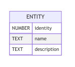

# QueryCraft

version `0.6`

Java  ORM framework to semplify DB connection and to generate istruction

> **<u>ATTENZIONE</u>**:
>
> Il query craft è ancora in fase di sviluppo. Non pronto per la produzione

## MYSQL : speed start e confronto con le metodologie classiche

Ancora prima di mostrare la documentazione, ecco una piccola anteprima di come facilmente si pu&ograve; impostare una connessione MySql con il QueryCraft.

Supponiamo di voler creare la seguente tabella :



con identity chiave primaria. Quindi di voler inserire in tabella:

| **IDENTITY** | **NAME** | **DESCRIPTION**                          |
| -----------: | :------: | ---------------------------------------- |
|          `1` |   DOGE   | *funny dog*                              |
|          `2` |  MARIO   | *italian plumber*                        |
|          `3` |  STEVEN  | *strange magic mix of diamond and a kid* |


### senza QueryCraft


### con QueryCraft

Crea una classe che rappresenti la tabella:

```java
public class Entity {
    private int identity;
    private String name;
    private String description;
    public Entity(int identity, String name, String description){
        setIdentity(identity);
        setName(name);
        setDescription(description);
    }
    public void setIdentity(int identity){this.identity=identity;}
    public void setName(String name){this.name=name;}
    public void setDescription(String description){this.description=description;}
}
```


Quindi in un programma esegui:

```java
public static void main(String []args){
	SQLConnectionCraft s = (SQLConnectionCraft) 
        new SQLConnectionCraft().url("ip.add.re.sss").user("root").psk("password");
    MySqlConnection m = new MySqlConnection(s);

    // create db
    DBCraft dbc = new SQLDBCraft().DB("DBName");
    m.exec(dbc.create());
    if (!m.getErrMsg().equals(""))
        throw new IllegalStateException("an error occur: " + m.getErrMsg());

    // create table
    TableCraft tc = new SQLTableCraft().DB("DBName").table(Entity.class).primary("identity");
    m.exec(tc.create());
    if (!m.getErrMsg().equals(""))
        throw new IllegalStateException("an error occur: " + m.getErrMsg());

    // insert data
    Entity e = new Entity(1, "DOGE", "funny dog");
    m.exec(tc.insertData(e).craft());
    if (!m.getErrMsg().equals(""))
        throw new IllegalStateException("an error occur: " + m.getErrMsg());

    e = new Entity(2, "MARIO", "italian plumber"); // con 1 non da errore... FIXME
    m.exec(tc.insertData(e).craft());
    if (!m.getErrMsg().equals(""))
        throw new IllegalStateException("an error occur: " + m.getErrMsg());

    e = new Entity(3, "STEVEN", "strange magic mix of diamond and a kid");
    m.exec(tc.insertData(e).craft());
    if (!m.getErrMsg().equals(""))
        throw new IllegalStateException("an error occur: " + m.getErrMsg());
    
}
```


## ConnectionCraft

> DOCUMENTAZIONE NON AGGIORNATA

### MySqlConnection  

Crea un istanza singleton di SQLConnectionCraft e la usa per le query

Fornisce anche alcune query:  

| nome metodo ( parametri input ) | output         | breve spiegazione                                   |
| ------------------------------- | -------------- | --------------------------------------------------- |
| `existDB( String nomeDB)`       | `boolean`      | resistuisce `true` se esiste il DB                  |
| `exec( String queryCompleta)`   | `boolean`      | esegue un istruzione MySql                          |
| `query( String queryCompleta)`  | `ResultSet`    | esegue una query, restituisce il ResultSet          |
| `listDB()`                      | `List<String>` | restituisce la Lista dei DB sotto forma di stringhe |


## QueryCraft

Nel package `psykeco.ioeasier.db.querycraft`  si può trovare un sottosistema di creazione delle query da mandare al DB.
Le istanze di `QueryCraft` sono builder che creano delle query a partire da coppia **chiave-valore** che gli vengono date in pasto.

L'interfaccia espone i metodi:

| **Nome metodo**                                    | **Descrizione**  *(***obbligatorio)*                         |
| -------------------------------------------------- | ------------------------------------------------------------ |
| `DB(String) : QueryCraft`                          | imposta il nome del DB*                                      |
| `table(String) : QueryCraft`                       | imposta il nome della tabella*                               |
| `entry(String column, String value) : QueryCraft`  | imposta una coppia colonna-valore all'operatore principale (select, update, insert, etc...) |
| `filter(String column, String value) : QueryCraft` | imposta una coppia colonna-valore alla where                 |
| `validate() : boolean`                             | valida la query, se false qualche parametro necessario non è stato impostato, oppure qualche valore non ha passato la regex |
| `craft() : String`                                 | costruisce la query sotto forma di stringa                   |

 

Sono inoltre disponibili i seguenti metodi/variabili statiche :

- `str(Object o):String`  :  restituisce la rappresentazione stringa dell'oggetto che verrà messa nel DB
  - nel caso delle stringhe ad esempio verranno aggiunti apici singoli `'`
- `BASE_REGEX : String` : è una variabile che rappresenta la regex che viene applicata ai singoli elementi che son imposti come nome colonna, nome db o nome tabella
- `VALUE_REGEX: STRING` : è una variabile che rappresenta la regex che viene applicata ai singoli elementi che  rappresenteranno i valori nelle query


Al momento son presenti le seguenti implementazioni di QueryCraft:


### exception

| Eccezione                       | messaggio                                                 | quando                                                       |
| ------------------------------- | --------------------------------------------------------- | ------------------------------------------------------------ |
| `UnsupportedOperationException` | SqlInsertCraft does not support filter                    | uso dei metodi filter su SqlInsertCraft (non  ha una where)  |
| `UnsupportedOperationException` | SqlDeleteCraft does not support entry                     | uso dei metodi entry su SqlDeleteCraft ( non ha campi di selezione ) |
| `IllegalArgumentException`      | nome tabella/db necessario                                | Durante la fase di validazione, è stata trovata una tabella o db esistente ( son due messaggi diversi, a seconda di cosa non è stato trovato) |
| `IllegalArgumentException`      | Una chiave/ il valore di una chiave è stata trovato vuoto | Durante la fase di validazione, è stata trovata una chiave o il valore di una chiave vuoti ( son due messaggi diversi, a seconda di cosa non è stato trovato) |
| `IllegalArgumentException`      | Nome tabella/db/chiave/valore non valido                  | Durante la fase di validazione, son stati trovati dei valori di tabella/db/chiave/valore non validi () son quattro messaggi diversi, a seconda di cosa non ha passato la regex) |

## SelectCraft

estende l'interfaccia QueryCraft aggiungendo le funzioni di join. Espone i metodi:

| **Nome metodo**                                              | **Descrizione** *(***obbligatorio)*                          |
| ------------------------------------------------------------ | ------------------------------------------------------------ |
| `alis(String) : SelectCraft`                                 | imposta un nome da usare come alias nella query              |
| `join(SelectCraft) : SelectCraft`                            | imposta un selectCraft per la join (al momento max=1)        |
| `joinFilter(Entry<String,String>) : SelectCraft`             | imposta una coppia di colonne che deve essere uguale tra la select this (primo valore) e la select in join |
| `joinFilter(String columntThis,String columnOther) : SelectCraft` | come sopra, ma preleva due stringhe in ingresso              |
| `selectCraft() : String`                                     | restituzione dei campi nella select                          |
| `fromCraft() : String`                                       | restituzione dei campi nella from                            |
| `whereCraft() : String`                                      | restituzione dei campi nella where                           |


L'unica implementazione attuale è `SQLSelectCraft`

> NOTA:
>
> Allo stato attuale non è completa l'implementazione

## TableCraft 

La `TableCraft` crea le istruzioni per generare, eliminare e trarre informazioni dalle tabelle a partire dalle classi java. Per farlo usa la **reflection**.

Espone i seguenti metodi:

| **Nome metodo**                | **Descrizione** *(***obbligatorio)*                          |
| ------------------------------ | ------------------------------------------------------------ |
| `DB(String) : TableCraft`      | imposta il nome del DB *                                     |
| `table(Class) : TableCraft`    | imposta il nome della tabella *                              |
| `suffix(String) : TableCraft`  | imposta un suffisso                                          |
| `prefix(String) : TableCraft`  | imposta un prefisso                                          |
| `primary(String) : TableCraft` | aggiunge una chiave primaria                                 |
| `validate() : boolean`         | valida la query, se false qualche parametro necessario non è stato impostato, oppure qualche valore non ha passato la regex |
| `create() : String`            | costruisce l' istruzione di creazione sotto forma di stringa |
| `select() : String`            | ccostruisce la select sotto forma di stringa                 |
| `drop() : String`              | costruisce l' istruzione di drop sotto forma di stringa      |
| `insertData(Object) : String`              | costruisce l' istruzione di insert usando un istanza      |
| `selectData(Object) : String`              | costruisce l' istruzione di select usando un istanza      |
| `updateData(Object) : String`              | costruisce l' istruzione di update usando un istanza  (la where viene impostata sui campi indicati con primary)    |
| `deleteData(Object) : String`              | costruisce l' istruzione di delete usando un istanza      |


L'unica implementazione disponibile è quella di `SQLTableCraft`


## DBCraft 

La `DBCraft` crea le istruzioni per generare, eliminare e trarre informazioni dalle tabelle a partire dalle classi java. Per farlo usa la **reflection**.

Espone i seguenti metodi:

| **Nome metodo**        | **Descrizione** *(***obbligatorio)*                          |
| ---------------------- | ------------------------------------------------------------ |
| `DB(String) : DBCraft` | imposta il nome del DB *                                     |
| `validate() : boolean` | valida la query, se false qualche parametro necessario non è stato impostato, oppure qualche valore non ha passato la regex |
| `create() : String`    | costruisce l' istruzione di creazione sotto forma di stringa |
| `select() : String`    | ccostruisce la select sotto forma di stringa                 |
| `drop() : String`      | costruisce l' istruzione di drop sotto forma di stringa      |


L'unica implementazione disponibile è quella di `SQLDBCraft`


## TODO

- ~~QueryCraft : join e filterJ (filter on join)~~
- controlli su alias 
- QueryCraft : gestire Date e GregorianCalendar
- QueryCraft : gestione File BLOB
- QueryCraft : UNIT TEST (rifare esistenti)
- ~~MySqlConnection : Generare valore di ritorno~~
- ~~MySqlConnection : gestire Messaggi di Errore~~
- MySqlConnection : UNIT TEST 